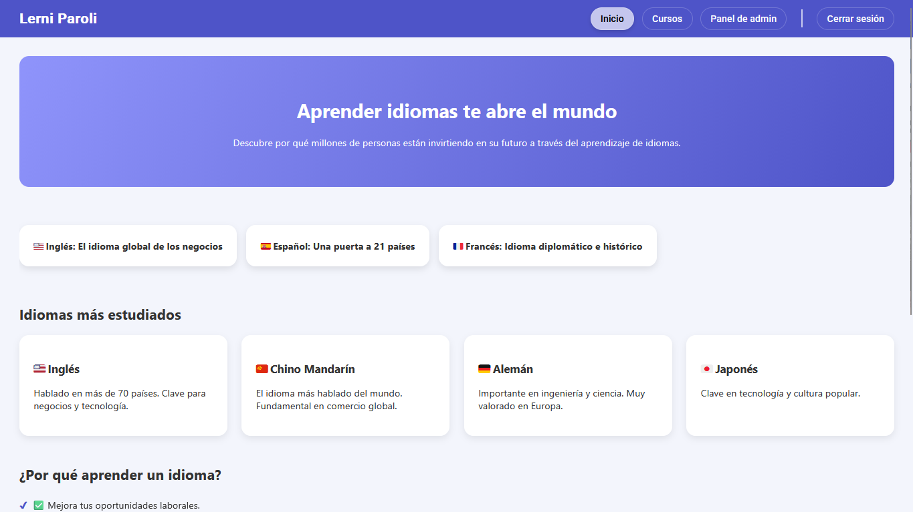

# 🌐 Lerni Paroli - Language Learning Web App

> A web application for learning languages built with **Angular**, **Express**, and **MongoDB**.  
> Administrators can create and manage courses, lessons, theory sections, and practice quizzes (similar to Duolingo), while users progress through interactive lessons and get instant feedback on their performance.

---

## Overview

**Lerni Paroli** is a full-stack language learning platform designed to:

- Allow administrators to create new languages, courses, lessons, and quizzes.
- Provide interactive lessons with **theory** and **practice** sections.
- Track user progress and provide feedback on quizzes (correct/wrong answers).
- Offer a structured curriculum similar to Duolingo, but fully customizable by the admin.

---

## 🧩 Key Features

### For Administrators

- Add, edit, and delete **languages** and **courses**.
- Create lessons containing **theory** content and **practice quizzes**.
- Configure quizzes with multiple-choice questions.

### For Users

- Browse and select available courses.
- Complete lessons with **theory** and **interactive quizzes**.
- Receive immediate feedback on quizzes (score, correct/wrong answers).
- Progress through lessons and courses in order.

---

## 🛠️ Tech Stack

- **Frontend:** Angular 16+  
- **Backend:** Express.js  
- **Database:** MongoDB   

## ⚙️ Installation

-Clone the repository

-Use "npm i" to install all the dependencies in both, frontend and backend

-Run the project!

